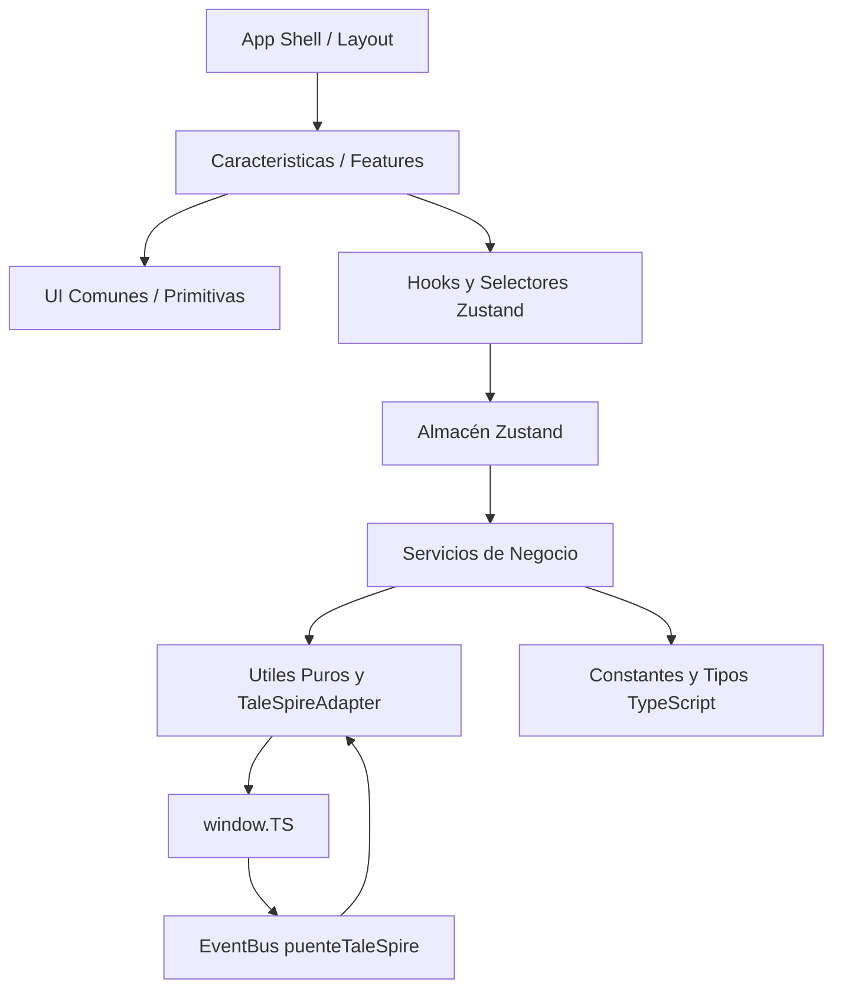

# Arquitectura

La aplicación separa la interfaz React, el estado de campaña, las reglas de negocio y la comunicación con TaleSpire. El punto de entrada visual es `src/App.tsx`.

## Capas y Flujo Unidireccional de Dependencias

> **Regla de Oro Unidireccional**: Las dependencias fluyen estrictamente de arriba hacia abajo. La lógica de negocio (`servicios`), la gestión de estado (`almacen`), los datos fijos (`constantes`), las utilidades (`utiles`) y los contratos (`tipos`) tienen **terminantemente prohibido** importar elementos o estilos de la capa visual (`componentes`). Esta regla se encuentra blindada y automatizada mediante `eslint` (`no-restricted-imports`).

### Capas de Interfaz de Usuario (UI Layers)

1. **Layout / Cascarón (`src/componentes/layout/`)**:
   - Elementos estructurales de la ventana de TaleSpire (`BarraSuperior`, `BarraControl`, `PanelDados`).
2. **Características (`src/componentes/caracteristicas/`)**:
   - Módulos organizados por dominio funcional de D&D 5.5e y rol de usuario:
     - `iniciativa`: Gestor del combate para DM (`GestorIniciativa`) y vista táctica del jugador (`IniciativaJugador`).
     - `personajes`: Vista de ficha (`VistaJugadores`), gestor de personajes, paneles de vitalidad, atributos y habilidades.
     - `inventario`: Vista de inventario (`VistaInventarioJugador`), panel táctico (`PanelInventarioPersonaje`), modales de inspección, drag & drop y transferencia rápida entre contenedores.
     - `ataques`: Vista de acciones del jugador (`VistaAtaquesJugador`), ataques físicos, mágicos, maestría y armas.
     - `rasgos`: Vista de dotes, especie y clase (`VistaRasgosJugador`), progresión y selección de invocaciones.
     - `compendio`: Búsqueda y fichas oficiales del SRD 2024 (`Compendio`, `ListaHechizos`, `FichaHechizo`).
     - `homebrew`: Creadores de contenido personalizado para el DM (`CreadorHomebrew`).
     - `tablas`, `notas`, `pendientes`, `configuracion`: Módulos auxiliares y de soporte de campaña.
3. **Comunes / Primitivas Visuales (`src/componentes/comunes/`)**:
   - Componentes transversales desacoplados de dominios específicos: selectores de accesibilidad CEF (`SelectorDesplegable`, `SelectorSugerencias`), tooltips instantáneos (`TooltipUniversal`), diálogos de confirmación (`ConfirmDialog`), límites de error (`LimiteError`), contenedor de toasts (`NotificacionesContenedor`) y renderizadores enriquecidos (`TextoEnriquecidoDND`).

Las pestañas pesadas o inactivas se cargan de forma diferida mediante `React.lazy` directamente desde el barril `index.ts` de su característica respectiva en `src/App.tsx`.

### Hooks y selectores

`src/hooks/usarConexionTaleSpire.ts` conecta el ciclo de vida de React con el adaptador y el puente. También carga datos persistidos, consulta la campaña, detecta el rol, obtiene la selección de criaturas y obtiene la cola inicial.

Los selectores de `src/almacen/selectores/` exponen fachadas con `useShallow`:

- `usarEstadoIniciativa.ts` concentra cola, rondas, turnos y criaturas seleccionadas.
- `usarEstadoPersonajes.ts` calcula estadísticas derivadas y expone estado de personajes.
- `usarEstadoHomebrew.ts` expone monstruos, hechizos y objetos personalizados.
- `usarEstadoConfiguracion.ts` expone pestaña, campaña, rol y preferencias.
- `usarEstadoUtiles.ts` expone notas, pendientes y encuentros.

### Almacén Zustand

`src/almacen/usarAlmacenDM.ts` combina cuatro slices:

- `sliceIniciativa.ts`: cola, ronda, turno activo, selección TaleSpire, criaturas, condiciones, efectos, plantillas y salvaciones en área.
- `slicePersonajes.ts`: personajes, vitalidad, descansos, salvaciones de muerte, cansancio, magia, inventario, monedas y rasgos.
- `sliceHomebrew.ts`: bases de datos de monstruos, hechizos y objetos, con operaciones de alta, edición y borrado.
- `sliceConfiguracion.ts`: pestaña activa, preferencias, pendientes, notas, encuentros, notificaciones, campaña y rol.

El middleware compara las claves persistibles antes y después de cada actualización. Las claves incluyen la cola, asociaciones, bases de datos, pendientes, notas, encuentros, personajes e identificador de personaje activo.

### Persistencia y sanitización

`src/almacen/persistencia.ts` prepara el estado completo y `src/utiles/almacenamientoTaleSpire.ts` lo guarda como un único blob global con la clave interna `__dm_pantalla_datos__`.

`src/almacen/sanitizacion.ts` sanea objetos, hechizos, monstruos y personajes importados o persistidos. `EsquemaPersonajeJugador.safeParse` valida el personaje final y rellena propiedades compatibles con versiones anteriores.

La carga y escritura usan `window.TS.localStorage.global` a través del adaptador. La carga ignora escrituras instantáneas mientras `cargandoDatos` está activo para evitar carreras de I/O.

## Servicios

`src/servicios/index.ts` exporta la lógica de iniciativa, criaturas, condiciones, descansos, miniaturas, inventario, munición, clases, rasgos, magia y sincronización de conjuros de subclase.

Ejemplos:

- `sincronizacionIniciativa.ts` filtra efectos expirados y reconcilia el estado local.
- `procesadorCondiciones.ts` aplica condiciones y evalúa su impacto en ataques, características, salvaciones e iniciativa.
- `gestorClases.ts` construye builds de clase y subclase.
- `calculadorMagia.ts` calcula lanzador, espacios, puntos, pacto y opciones de lanzamiento.
- `gestorMunicion.ts` resuelve compatibilidad de munición y contenedores.

## Puente de eventos

`src/servicios/puenteTaleSpire.ts` implementa un EventBus tipado. Cada evento tiene un mapa de payload y `on` devuelve una función de desuscripción.

`registrarCallbacksGlobales` instala en `window` los callbacks declarados en `manifest.json`:

- `manejarCambioEstadoSimbionte`.
- `manejarCambioEstadoCriatura`.
- `manejarCambioSeleccionCriatura`.
- `manejarEventoIniciativa`.
- `manejarResultadosDados`.
- `manejarEventoCliente`.

También registra `window.initiativeUpdated` para la actualización de iniciativa y escucha eventos DOM equivalentes como redundancia de CEF.

Los eventos se traducen a nombres internos: `estadoSimbionte`, `estadoCriatura`, `seleccionCriaturas`, `iniciativaActualizada`, `resultadosDados` y `eventoCliente`. Los payloads que llegan como JSON se deserializan antes de emitirlos.

## Inicialización

`usarConexionTaleSpire` intenta suscribirse de inmediato. Si `window.TS` todavía no está disponible, sondea durante un máximo de 15 segundos.

Una vez establecido el canal, espera 500 ms antes de consultar la API. Ese retraso evita enviar mensajes antes de registrar el canal del Symbiote y previene el error `outOfOrderMessage`.
